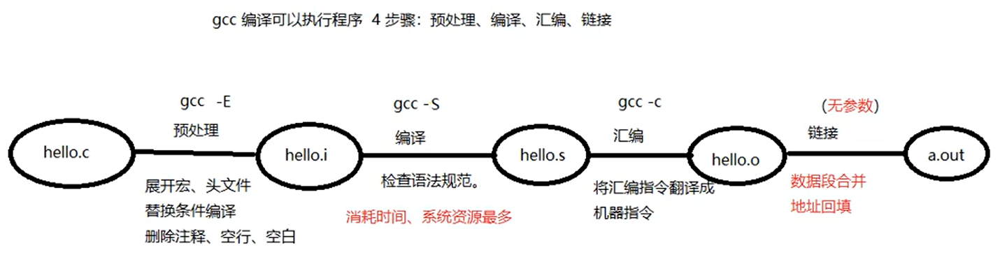
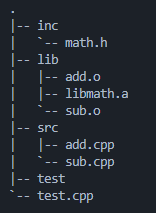

# cmd

## dir

## chmod

## find

+ -type：按文件类型搜索 d/p/s/c/b/l/f

  ```sh
  # ./ 表示当前目录
  # 默认递归查找，-maxdepth指定深度
  find ./ -maxdepth 1 -type f
  ```

+ -name：按文件名搜索

  ```sh
  find ./ -maxdepth 1 -name 'r*'
  ```

+ -maxdepth：指定搜索深度（默认做第一参数）

  ```sh
  find ./ -maxdepth 1 -type f
  ```

+ -size：按文件大小搜索. 单位：k、M、G

  ```sh
  find ./ -size +20M -size -50M
  ```

+ -atime、-mtime、-ctime：天

  -amin、-mmin、-cmin：分钟

+ -exec：将find的结果集执行某一指定命令。

  ```sh
  find ./ -type f -exec ls -l {} \;
  ```

+ -ok：以交互式的方式，将find搜索结果集执行某一指定命令

  ```sh
  find ./ -type f -ok ls -l {} \;
  ```

## grep

```sh
# -r：递归 -n：显示行号
# 递归检索当面目录
grep -r 'copy' ./ -n
# 检索指定文件
grep 'set' CMakeLists.txt -n
# 通过管道符将ps命令结果传给grep进行查找
ps aux | grep 'cupsd'
```

## xargs

> xargs默认以空格分割结果集单个项目
>
> 当结果集数量过大时，xargs可以对结果集进行分片映射

```sh
find ./ -maxdepth 1 -type f -exec ls -l {} \;
# 将find搜索的结果集执行某一指定命令。当结果集数量过大时，可以分片映射。下式不加xargs结果会出错。
find ./ -maxdepth 1 -type f | xargs ls -l
# -print0以0替代空格对结果集进行分割
find ./ -maxdepth 1 -type f -print0 | xargs -0 ls -l
```

## rpm

## yum

```sh
yum install sl
yum remove sl
yum list
yum search sl
yum update
yum update sl
```

## tar

+ 压缩

  ```sh
  # z：压缩方式 gzip
  # c：create
  # v：显示压缩过程
  # f：文件
  tar zcvf test.tar.gz file1 dir2 #使用gzip方式压缩
  tar jcvf test.tar.gz file1 dir2 #使用bzip2方式压缩
  ```

+ 解压

  ```sh
  tar zxvf test.tar.gz file1 dir2 #使用gzip方式解压缩
  tar jxvf test.tar.gz file1 dir2 #使用bzip2方式解压缩
  ```

  

# vim

## 命令

+ 插入：a 光标后、i 光标前、o 下一行
+ 撤销：u、ctrl+r
+ 删除（实为剪切）：
  + 单个字符：x
  + 一个单词(向后删除)：dw
  + d+home，d+end
  + 删除括号内容：di( 
  + 删除块：v+hjkl+d （v进入可视模式）
  + 删除行：dd，ndd（n行）
+ 复制粘贴：
  + 复制：yy
  + 粘贴：p
+ 查找替换：
  + /+sth，回车，n下一个
  + 光标选中按 *，再按下一个
  + 替换字符：r+s
+ 跳转：
  + 跳转文件首：gg
  + 跳转文件尾：G
  + 跳转指定行：88G、:88
  + 大括号跳转：%
+ 分屏：
  + 横分：sp
  + 竖分：vsp
+ 挪动光标：hjkl
+ 自动格式化程序：gg=G

## 配置


# gcc

> gcc用来编译c语言，g++编译c++



+ -I：指定头文件所在目录位置

+ -o：指定输出文件名

+ -c：只做预处理、编译、汇编。得到二进制文件

+ -g：编译时添加调试语句。主要支持gdb调试

+ -Wall：显示所有警告信息

+ -D：向程序中“动态”注册宏定义

+ -l：指定动态库名

+ -L：指定动态库路径

  ```sh
  gcc hello.cpp -I ./include -o hello -g -Wall -D HELLO
  ```

# lib

## 静态库

### 步骤

1. 将 .c 生成 .o 文件

   ```sh
   gcc -c add.c -o add.o
   ```

2. 使用 ar 工具制作静态库

   ```sh
   ar rcs lib[name].a add.o sub.o div.o
   ```

3. 编译静态库到可执行文件中

   ```sh
   gcc test.c lib[name].a -o 
   ```

### Template



```sh
[root@ src] g++ -c add.cpp -o add.o
[root@ src] g++ -c sub.cpp -o sub.o
[root@ src] ar rcs libmath.a add.o sub.o
[root@ src] mv libmath.a *.o ../lib
[root@ lib] g++ test.cpp ./lib/libmath.a -o test -I ./inc
```

```c++
// test.cpp
#include<iostream>
#include"math.h"
using namespace std;
int main(){
        int a=9,b=5;
        cout<<"add("<<a<<","<<b<<") = "<<add(a,b)<<endl;
        cout<<"sub("<<a<<","<<b<<") = "<<sub(a,b)<<endl;
        return 0;
}
```

```c++
// math.h
#ifndef MATH_H
#define MATH_H
int add(int,int);
int sub(int,int);
#endif
```


## 动态库 

### 步骤

1. 将.c生成.o文件，（生成与位置无关的代码 -fPIC）

   ```sh
   [root@ src] g++ -c add.cpp -o add.o -fPIC
   ```

2. 使用 gcc -shared 制作动态库

   ```sh
   [root@ src] g++ -shared -o libmath.so add.o sub.o
   ```

3. 编译可执行程序时，指定所使用的动态库。-l：指定库名(去掉lib前缀和.so后缀) -L：指定库路径

   ```sh
   [root@ src] g++ test.cpp -o test -lmath -L./lib -I./inc
   ```

4. 运行可执行程序 ./test 出错！！！

   > error while loading shared 1ibraries: 1ibxxx.so: cannot open shared object file: No such file or directory

   + 原因：
     + 链接器：工作于链接阶段，工作时需要 -l 和 -L
     + 动态链接器：工作于程序运行阶段，工作时需要提供动态库所在目录位置
   + 解决方法：
     + [临时] 通过环境变量：export LD_LIBRARY_PATH=dir
     + [永久] 写入终端配置文件：
       1. vi ~/.bashrc
       2. 写入export LD_LIBRARY_PATH=dynamic_lib_dir
       3. . .bashrc   /   source .bashrc   /   重启终端
     + [永久] 拷贝自定义动态库到 /lib（标准C库所在目录）
     + [永久] 配置文件法：
       1. vi /etc/ld.so.conf
       2. 写入动态库绝对路径
       3. ldconfig -v 使配置文件生效

```sh
[root@ src] g++ -c add.cpp -o add.o -fPIC
[root@ src] g++ -c sub.cpp -o sub.o -fPIC
[root@ src] g++ -shared -o libmath.so add.o sub.o
[root@ src] mv libmath.so *.o ../lib
```


### Template


# gdb

基础指令：

+ -g：使用该参数编译可执行文件，得到调试表
+ gdb ./a.out 调试a.out
+ list：list 1 列出源码。根据源码行号设置断点
+ b：b 20 在20行设置断点
+ delete/d：删除断点
+ run/r：运行调试
+ next/n：下一步（越过函数）
+ step/s：下一步（进入函数）
+ print/p：p i 查看变量的值
+ continue：继续执行断点后续指令
+ quit：退出gdb调试

其他指令：

+ finish：结束当前函数调用
+ set args：设置main函数命令行参数
+ info b：查看断点信息表
+ b 20 if i=5：设置条件断点
+ ptype：查看变量类型
+ bt：列出当前程序存活的栈帧
+ frame：根据栈帧编号，切换栈帧
+ display：设置跟踪变量
+ undisplay：取消设置跟踪变量


# makefile

## 基本语法

> 命名：makefile、Makefile
>
> 默认将第一个目标作为终极目标，all 可改变

+ 1个规则：

  ```makefile
  目标：依赖条件
  (tab) 命令
  ```

   	1. 目标的时间必须晚于依赖条件的时间，否则，更新目录
   	2. 依赖条件如果不存在，找寻新的规则去产生依赖

+ 2个函数：

  ```makefile
  #匹配当前目录下所有.c文件。将文件名组成列表，赋值给变量src
  src = $(wildcard *.c)
  #将参数3中，包含参数1的部分，替换为参数2（此处即将.c后缀替换为.o），并赋值给obj
  obj = $(patsubst %.c, %.o, $(src))
  ```

+ 3个自动变量：

  + $@：在规则的命令中，表示规则中的目标
  + $^：在规则的命令中，表示所有依赖条件
  + $<：在规则的命令中，表示第一个依赖条件。如果该变量应用在模式规则中，它可将依赖条件列表中的依赖依次取出，套用模式规则。

+ 模式规则：

  ```makefile
  %.o:%.c
  	g++ -c $< -o $@
  # 静态模式规则
  $(obj):%.o:%.c
  	g++ -c $< -o $@
  ```

+ 伪目标：

  ```makefile
  .PHONY: clean all
  ```

+ 参数：

  + -n：模拟执行make、make clean命令
  + -f：指定文件执行make命令

+ other：

  + all：指定 makefile 的终极目标

  + clean（没有依赖）

    ```makefile
    clean:
    	-rm -rf $(obj) a.out #‘-’作用是，删除不存在文件时，不报错，顺序执行结束
    ```

## Template

```makefile
src = $(wildcard *.c)
obj = $(patsubst %.c, %.o, $(src))

myArgs= -Wall -g
ALL:a.out

a.out: $(obj)
	g++ $^ -o $@ $(myArgs)
	
$(obj):%.o:%.c
	g++ -c $< -o $@ $(myArgs)
	
clean:
	-rm -rf $(obj) a.out
.PHONY: clean ALL
```

 

# 系统编程

```sh
# 安装man-pages
yum install man-pages
# 查看手册
man man
# 查看函数系统调用
man 2 open
```


## 文件IO

### open

```c++
#include<unistd.h>
/**
args: 
	pathname:文件路径名
	flags：文件打开方式 O_RDONLY|O_WRONLY|O_RDWR     O_CREAT|O_APPEND|O_TRUNC|O_EXCL|O_NONBLOCK
return：
	success: file descriptor
	fail:-1 & errno
**/
int open(char *pathname, int flags);
//	mode:参数2指定O_CREAT时使用此参数，用来指定文件权限，受umask影响，最终权限与umask相与
int open(char *pathname, int flags, mode_t mode);
```

```c++
//template
int fd = open(src_path,O_RDWR);
int fd = open(src_path,O_RDWR|O_CREAT,0777);
```

### close

```c++
int close(int fd);
```

### strerror

```c++
#include<string.h>
#include<errno.h>
char* strerror(int errno);
```


