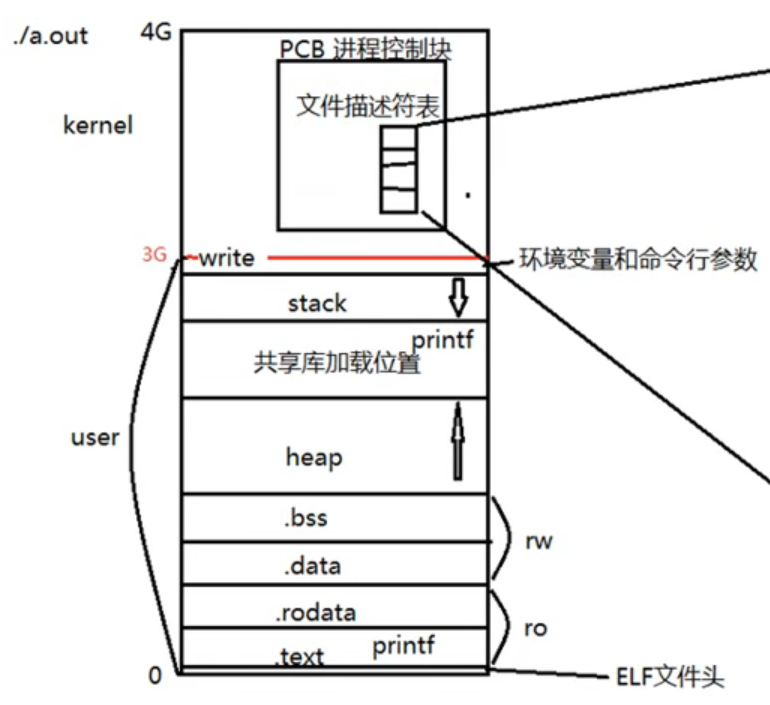

#  cmd

## dir

## chmod

## find

+ -type：按文件类型搜索 d/p/s/c/b/l/f

  ```sh
  # ./ 表示当前目录
  # 默认递归查找，-maxdepth指定深度
  find ./ -maxdepth 1 -type f
  ```

+ -name：按文件名搜索

  ```sh
  find ./ -maxdepth 1 -name 'r*'
  ```

+ -maxdepth：指定搜索深度（默认做第一参数）

  ```sh
  find ./ -maxdepth 1 -type f
  ```

+ -size：按文件大小搜索. 单位：k、M、G

  ```sh
  find ./ -size +20M -size -50M
  ```

+ -atime、-mtime、-ctime：天

  -amin、-mmin、-cmin：分钟

+ -exec：将find的结果集执行某一指定命令。

  ```sh
  find ./ -type f -exec ls -l {} \;
  ```

+ -ok：以交互式的方式，将find搜索结果集执行某一指定命令

  ```sh
  find ./ -type f -ok ls -l {} \;
  ```

## grep

```sh
# -r：递归 -n：显示行号
# 递归检索当面目录
grep -r 'copy' ./ -n
# 检索指定文件
grep 'set' CMakeLists.txt -n
# 通过管道符将ps命令结果传给grep进行查找
ps aux | grep 'cupsd'
```

## xargs

> xargs默认以空格分割结果集单个项目
>
> 当结果集数量过大时，xargs可以对结果集进行分片映射

```sh
find ./ -maxdepth 1 -type f -exec ls -l {} \;
# 将find搜索的结果集执行某一指定命令。当结果集数量过大时，可以分片映射。下式不加xargs结果会出错。
find ./ -maxdepth 1 -type f | xargs ls -l
# -print0以0替代空格对结果集进行分割
find ./ -maxdepth 1 -type f -print0 | xargs -0 ls -l
```

## rpm

## yum

```sh
yum install sl
yum remove sl
yum list
yum search sl
yum update
yum update sl
```

## tar

+ 压缩

  ```sh
  # z：压缩方式 gzip
  # c：create
  # v：显示压缩过程
  # f：文件
  tar zcvf test.tar.gz file1 dir2 #使用gzip方式压缩
  tar jcvf test.tar.gz file1 dir2 #使用bzip2方式压缩
  ```

+ 解压

  ```sh
  tar zxvf test.tar.gz file1 dir2 #使用gzip方式解压缩
  tar jxvf test.tar.gz file1 dir2 #使用bzip2方式解压缩
  ```

  

# vim

## 命令

+ 插入：a 光标后、i 光标前、o 下一行
+ 撤销：u、ctrl+r
+ 删除（实为剪切）：
  + 单个字符：x
  + 一个单词(向后删除)：dw
  + d+home，d+end
  + 删除括号内容：di( 
  + 删除块：v+hjkl+d （v进入可视模式）
  + 删除行：dd，ndd（n行）
+ 复制粘贴：
  + 复制：yy
  + 粘贴：p
+ 查找替换：
  + /+sth，回车，n下一个
  + 光标选中按 *，再按下一个
  + 替换字符：r+s
+ 跳转：
  + 跳转文件首：gg
  + 跳转文件尾：G
  + 跳转指定行：88G、:88
  + 大括号跳转：%
+ 分屏：
  + 横分：sp
  + 竖分：vsp
+ 挪动光标：hjkl
+ 自动格式化程序：gg=G

## 配置


# gcc

> gcc用来编译c语言，g++编译c++


+ -I：指定头文件所在目录位置

+ -o：指定输出文件名

+ -c：只做预处理、编译、汇编。得到二进制文件

+ -g：编译时添加调试语句。主要支持gdb调试

+ -Wall：显示所有警告信息

+ -D：向程序中“动态”注册宏定义

+ -l：指定动态库名

+ -L：指定动态库路径

  ```sh
  gcc hello.cpp -I ./include -o hello -g -Wall -D HELLO
  ```

# lib

## 静态库

### 步骤

1. 将 .c 生成 .o 文件

   ```sh
   gcc -c add.c -o add.o
   ```

2. 使用 ar 工具制作静态库

   ```sh
   ar rcs lib[name].a add.o sub.o div.o
   ```

3. 编译静态库到可执行文件中

   ```sh
   gcc test.c lib[name].a -o 
   ```

### Template


```sh
[root@ src] g++ -c add.cpp -o add.o
[root@ src] g++ -c sub.cpp -o sub.o
[root@ src] ar rcs libmath.a add.o sub.o
[root@ src] mv libmath.a *.o ../lib
[root@ lib] g++ test.cpp ./lib/libmath.a -o test -I ./inc
```

```c++
// test.cpp
#include<iostream>
#include"math.h"
using namespace std;
int main(){
        int a=9,b=5;
        cout<<"add("<<a<<","<<b<<") = "<<add(a,b)<<endl;
        cout<<"sub("<<a<<","<<b<<") = "<<sub(a,b)<<endl;
        return 0;
}
```

```c++
// math.h
#ifndef MATH_H
#define MATH_H
int add(int,int);
int sub(int,int);
#endif
```


## 动态库 

### 步骤

1. 将.c生成.o文件，（生成与位置无关的代码 -fPIC）

   ```sh
   [root@ src] g++ -c add.cpp -o add.o -fPIC
   ```

2. 使用 gcc -shared 制作动态库

   ```sh
   [root@ src] g++ -shared -o libmath.so add.o sub.o
   ```

3. 编译可执行程序时，指定所使用的动态库。-l：指定库名(去掉lib前缀和.so后缀) -L：指定库路径

   ```sh
   [root@ src] g++ test.cpp -o test -lmath -L./lib -I./inc
   ```

4. 运行可执行程序 ./test 出错！！！

   > error while loading shared 1ibraries: 1ibxxx.so: cannot open shared object file: No such file or directory

   + 原因：
     + 链接器：工作于链接阶段，工作时需要 -l 和 -L
     + 动态链接器：工作于程序运行阶段，工作时需要提供动态库所在目录位置
   + 解决方法：
     + [临时] 通过环境变量：export LD_LIBRARY_PATH=dir
     + [永久] 写入终端配置文件：
       1. vi ~/.bashrc
       2. 写入export LD_LIBRARY_PATH=dynamic_lib_dir
       3. . .bashrc   /   source .bashrc   /   重启终端
     + [永久] 拷贝自定义动态库到 /lib（标准C库所在目录）
     + [永久] 配置文件法：
       1. vi /etc/ld.so.conf
       2. 写入动态库绝对路径
       3. ldconfig -v 使配置文件生效

```sh
[root@ src] g++ -c add.cpp -o add.o -fPIC
[root@ src] g++ -c sub.cpp -o sub.o -fPIC
[root@ src] g++ -shared -o libmath.so add.o sub.o
[root@ src] mv libmath.so *.o ../lib
```


### Template


# gdb

基础指令：

+ -g：使用该参数编译可执行文件，得到调试表
+ gdb ./a.out 调试a.out
+ list：list 1 列出源码。根据源码行号设置断点
+ b：b 20 在20行设置断点
+ delete/d：删除断点
+ run/r：运行调试
+ next/n：下一步（越过函数）
+ step/s：下一步（进入函数）
+ print/p：p i 查看变量的值
+ continue：继续执行断点后续指令
+ quit：退出gdb调试

其他指令：

+ finish：结束当前函数调用
+ set args：设置main函数命令行参数
+ info b：查看断点信息表
+ b 20 if i=5：设置条件断点
+ ptype：查看变量类型
+ bt：列出当前程序存活的栈帧
+ frame：根据栈帧编号，切换栈帧
+ display：设置跟踪变量
+ undisplay：取消设置跟踪变量

gdb只能跟踪一个进程。可在**fork函数调用前**，通过指令设置gdb调试工具跟踪父进程或子进程。默认跟踪父进程。

```sh
set follow-fork-mode child #设置跟踪子进程
set follow-fork-mode parent #设置跟踪父进程
```

# makefile

## 基本语法

> 命名：makefile、Makefile
>
> 默认将第一个目标作为终极目标，all 可改变

+ 1个规则：

  ```makefile
  目标：依赖条件
  (tab) 命令
  ```

   	1. 目标的时间必须晚于依赖条件的时间，否则，更新目录
   	2. 依赖条件如果不存在，找寻新的规则去产生依赖

+ 2个函数：

  ```makefile
  #匹配当前目录下所有.c文件。将文件名组成列表，赋值给变量src
  src = $(wildcard *.c)
  #将参数3中，包含参数1的部分，替换为参数2（此处即将.c后缀替换为.o），并赋值给obj
  obj = $(patsubst %.c, %.o, $(src))
  ```

+ 3个自动变量：

  + $@：在规则的命令中，表示规则中的目标
  + $^：在规则的命令中，表示所有依赖条件
  + $<：在规则的命令中，表示第一个依赖条件。如果该变量应用在模式规则中，它可将依赖条件列表中的依赖依次取出，套用模式规则。

+ 模式规则：

  ```makefile
  %.o:%.c
  	g++ -c $< -o $@
  # 静态模式规则
  $(obj):%.o:%.c
  	g++ -c $< -o $@
  ```

+ 伪目标：

  ```makefile
  .PHONY: clean all
  ```

+ 参数：

  + -n：模拟执行make、make clean命令
  + -f：指定文件执行make命令

+ other：

  + all：指定 makefile 的终极目标

  + clean（没有依赖）

    ```makefile
    clean:
    	-rm -rf $(obj) a.out #‘-’作用是，删除不存在文件时，不报错，顺序执行结束
    ```

## Template

```makefile
src = $(wildcard *.c)
obj = $(patsubst %.c, %.o, $(src))

myArgs= -Wall -g
ALL:a.out

a.out: $(obj)
	g++ $^ -o $@ $(myArgs)
	
$(obj):%.o:%.c
	g++ -c $< -o $@ $(myArgs)
	
clean:
	-rm -rf $(obj) a.out
.PHONY: clean ALL
```

```makefile
src = $(wildcard ./src/*.cpp)
# obj = $(patsubst ./src/%.cpp, ./bin/%.o, $(src))

args = -Wall -g
all:demo.out

demo.out: $(src)
        g++ $^ -o ./bin/$@ $(args)

# $(obj):./bin/%.o:./src/%.cpp
#       g++ -c $< -o $@ $(args)

clean:
        -rm -rf $(obj) ./bin/demo.out
.PHONY: clean all
```


 

# 系统编程

```sh
# 安装man-pages
yum install man-pages
# 查看手册
man man
# 查看函数系统调用
man 2 open
```

## common

### 基础知识


+ inode

  其本质为结构体，存储文件的属性信息。如：权限、类型、大小、时间、用户、盘块位置……也叫作文件属性管理结构，大多数的 inode 都存储在磁盘上。
  少量常用、近期使用的inode会被缓存到内存中。

+ dentry

  **目录项**，其本质依然是结构体，重要成员变量有两个{文件名，inode，...}，而文件内容 (data) 保存在磁盘盘块中。

硬连接&软连接

硬连接：等于创建一个目录项


### 文件描述符

|  |  |
| ---------------- | ----------------- |

+ PCB进程控制块：本质是结构体

+ 成员：文件描述符表

+ 文件描述符：0/1/2/3/4.../1023（默认使用表中可用的最小值）

  + 0：STDIN_FILENO

  + 1：STDOUT_FILENO

  + 2：STDERR_FILENO


### 阻塞 / 非阻塞

> 阻塞/非阻塞：是设备文件、网络文件的属性

产生阻塞的场景。读**设备文件**。读**网络文件**。(读常规文件无阻塞概念)

```c++
// /dev/tty -- 终端文件
//设置 /dev/tty 为非阻塞状态（默认阻塞）
open("/dev/tty",O_RDWR|O_NONBLOCK);
```

### func

+ strerror

  ```c++
  #include<string.h>
  #include<errno.h>
  char* strerror(int errno);
  ```

+ perror

  ```c++
  void perror(const char* s);
  perror("perror test");
  ```

+ strace

> 命令：输出程序执行过程中的系统调用

+ fcntl

  

  ```c++
  #include<unistd.h>
  #include<fcntl.h>
  /*
  args:
  	fd：文件描述符
  	cmd：操作命令
  cmd:
  	F_DUPFD：Find the lowest numbered available file descriptor 				greater than or equal to arg and make it be a copy of fd.
  	F_GETFL
  	F_SETFL
  return:
  	取决于操作命令
  */
  int fcntl(int fd, int cmd, ...arg);
  ```

  ```c++
  //template
  int flags = fcntl(fd,F_GETFL);
  flags |= O_NONBLOCK;
  fcntl(STDIN_FILENO, F_SETFL, flags);
  ```

+ dup

  ```c++
  #include<unistd.h>
  /*
  args:
  	oldfd：原文件描述符
  	newfd：新文件描述符
  return:
  	success：new descriptor
  	fail：-1 & errno
  */
  int dup(int oldfd);
  // newfd -> oldfd
  int dup2(int oldfd,int newfd);
  ```

  


## 文件IO

### open

```c++
#include<unistd.h>
/**
args: 
	pathname:文件路径名
	flags：文件打开方式 O_RDONLY|O_WRONLY|O_RDWR     O_CREAT|O_APPEND|O_TRUNC|O_EXCL|O_NONBLOCK
return：
	success: file descriptor
	fail:-1 & errno
**/
int open(char *pathname, int flags);
//	mode:参数2指定O_CREAT时使用此参数，用来指定文件权限，受umask影响，最终权限与umask相与
int open(char *pathname, int flags, mode_t mode);
```

```c++
//template
int fd = open(src_path,O_RDWR);
int fd = open(src_path,O_RDWR|O_CREAT,0777);
```

### close

```c++
int close(int fd);
```

### read / write


> 预读入缓输出

```c++
#include <unistd.h>
/**
args: 
	fd：文件描述符
	buf：缓冲区
	count：字节数（bytes）
return：
	n: 读取的字节数
	0：indicates end of file
	-1：error & errno. if errno==EAGIN | EWOULDBLOCK则考虑非阻塞时无数据		情况
**/
ssize_t read(int fd, void *buf, size_t count);
//template
int n = read(fd1,buf,1024);
```

```c++
#include <unistd.h>
/**
args: 
	fd：文件描述符
	buf：缓冲区
	count：字节数（bytes）
return：
	n: 写入的字节数
	-1：error & errno
**/
ssize_t write(int fd, const void *buf, size_t count);
//template
write(fd2,buf,n);
```


### lseek

> 文件读写使用同一偏移位置

```c++
/*
args:
	fd：文件描述符
	offset：偏移量
	whence：起始偏移位置：SEEK_SET/SEEK_CUR/SEEK_END
return:
	success：较起始位置偏移量
	fail：-1 & errno
application:
	1.读写使用同一偏移位置
	2.使用lseek获取拓展文件大小(可用stat()替代)
	3.使用lseek拓展文件大小(想要真正拓展，必须引起IO操作，可用truncate())
*/
off_t lseek(int fd, off_t offset, int whence);
```

### stat

```c++
/*
args:
	path：文件路径
	buf：存放文件属性
return:
	success：0
	fail：-1 & errno
other：
	符号穿透：stat会，lstat不会
*/
int stat(const char* path,struct stat *buf);
struct stat{
    st_size,//获取文件大小
    st_mode,//获取文件类型
}
```


### link/unlink

+ link：可以为已存在的文件创建目录项（硬链接）

  ```c++
  /*
  args:
  	oldpath：旧文件路径
  	newpath：新文件路径
  return:
  	success：0
  	fail：-1 & errno
  other：
  	mv命令即是修改了目录项，而并不修改文件本身
  */
  int link(const* oldpath,const char* newpath);
  ```

+ unlink：删除一个文件的目录项

  ```c++
  /*
  args:
  	pathname：文件路径
  return:
  	success：0
  	fail：-1 & errno
  note：
  	unlink函数的特征:清除文件时，如果文件的硬链接数到0了，没有dentry对应，但该文件仍不会马上被释放。要等到所有打开该文件的进程关闭该文件，系统才会挑时间将该文件释放掉。
  */
  int unlink(const char* pathname);
  ```

+ 隐式回收：当进程结束运行时，所有该进程打开的文件会被关闭，申请的内存空间会被释放。系统的这一特性称之为隐式回收系统资源。


## dir

注意：目录文件也是“文件”。其文件内容是该目录下所有子文件的目录项dentry。可以尝试用vim打开一个目录。   

### opendir

```c++
/*
args:
	name：目录名
return:
	success：0
	fail：-1 & errno
*/
DIR* opendir(char* name);
```

### closedir

```c++
/*
args:
	dp：目录指针
return:
	success：0
	fail：-1 & errno
*/
DIR* closedir(DIR* dp);
```

### readdir

```c++
/*
args:
	dp：目录指针
return:
	success：0
	fail：-1 & errno
*/
struct dirent* readdir(DIR* dp);
struct dirent{
    inode
    char dname[256];
}
```


## 进程

> kill -l

### 内存映射


### PCB

每个进程在内核中都有一个**进程控制块(PCB)**来维护进程相关的信息，Linux内核的进程控制块是task_struct 结构体。

PCB进程控制块：

+  进程id
+ 文件描述符表
+ 进程状态：初始态、就绪态、运行态、挂起态、终止态
+ 进程工作目录：
+ *umask掩码
+ 信号相关信息资源
+ 用户id和组id

### 环境变量

```sh
# 查看所有环境变量
env
```

### fork

```c++
/*
args: void
return:
	success：父进程返回子进程pid、子进程返回0
	fail：-1 & errno
note：
	通过返回值判断当前进程
*/
pid_t fork(void);
//获取当前进程pid
pid_t getpid(void);
//获取父进程pid
pid_t getppid(void);
```

注：

+ fork后进程执行顺序不确定，取决于内核所用的调度算法
+ 在子进程中使用getppid返回1，是由于父进程先退出，造成子进程被init（id=1）接管


### 进程共享

父子进程间遵循**读时共享写时复制**原则

+ 相同

  刚fork后：data段、text段、堆、栈、环境变量、全局变量、宿主目录位置、进程工作目录位置、信号处理方式

+ 不同

  进程id、返回值、各自的父进程、进程创建时间、闹钟、未决信号集

+ 共享

  1. 文件描述符
  2. mmap映射区

### exec

```c++
/*
args: 
return:
	只有失败时才返回
	fail：-1 & errno
note：
	l(list)：命令行参数列表
	p(path)：搜索file时使用path变量
	v(vector)：使用命令行参数数组
	e(environment)：使用环境变量数组，不使用进程原有的环境变量，设置新加载程序运行的环境变量
*/
int execl(const char* path,const char* arg,...);
int execlp(const char* file,const char* arg,...);
int execle(const char* path,const char* arg,...,char* const envp[]);
int execv(const char* path,char* const argv[]);
int execvp(const char* file,char* const argv[]);
int execve(const char* path,char* const argv[],char* const envp[]);

//template
//此函数参数从argv[0]开始算，因此要写两遍“ls”，第一遍是文件名，第二遍是命令行参数
execlp("ls","ls","-l",NULL);
```

###  回收子进程

+ 孤儿进程

  孤儿进程：父进程先于子进程结束，则子进程成为孤儿进程，init进程成为子进程的父进程，称为init进程 (进程孤儿院) 领养孤儿进程。

+ 僵尸进程

  僵尸进程：进程终止，父进程尚未回收，子进程残留资源（PCB）存放于内核中，变成僵尸(zombie）进程。

  特别注意，僵尸进程是不能使用kill命令清除掉的。因为kill命令只是用来终止进程的,而僵尸进程已经终止。此时，需要杀死父进程，子进程被init进程接管进行清理工作。

+ wait

  + 阻塞等待子进程退出
  + 清理子进程残留在内核的pcb资源
  + 通过参数传出子进程结束状态

  ```c++
  #include <sys/wait.h>
  //详见 man 2 wait
  // 一次wait/waitpid函数调用，只能回收一个子进程
  pid_t wait(int *status);
  
  int waitid(idtype_t idtype, id_t id, siginfo_t *infop, int options);
  ```

  ```c++
  //template
  int status;
  pid_t pid = fork();
  if(pid == 0){
  	cout<<"=====sub====="<<endl;
  	cout<<"pid: "<<getpid()<<" ppid: "<<getppid()<<endl;
  	sleep(15);
  	return 66;
  }else if (pid > 0){
  	cout<<"=====parent====="<<endl;
  	cout<<"pid: "<<getpid()<<" ppid: "<<getppid()<<" subid: "<<pid<<endl;
  	cout<<"waiting..."<<endl;
      // wait...
  	pid_t wpid = wait(&status);
  	if(WIFEXITED(status)){
  		cout<<"sub process exit normally "<<WEXITSTATUS(status)<<endl;
  	}else if (WIFSIGNALED(status)){
          //termsig：kill -9 sub_pid
  		cout<<"sub process exit with termsig: "<<WTERMSIG(status)<<endl;
  	}	
  }else if (pid==-1){
  	perror("create sub process failed");
  }
  return 0;
  ```

+ waitpid

  ```c++
  #include <sys/wait.h>
  /*
  args: 
  	pid：指定回收的子进程pid
  	status：传出进程回收状态
  	options：WNOHANG指定为非阻塞回收
  return:
  	>0：返回成功回收的子进程pid
  	0：函数调用时，参3指定了WNOHANG， 并且，没有子进程结束。
  	-1：fail & errno
  */
  pid_t waitpid(pid_t pid, int *status, int options);
  ```

  


